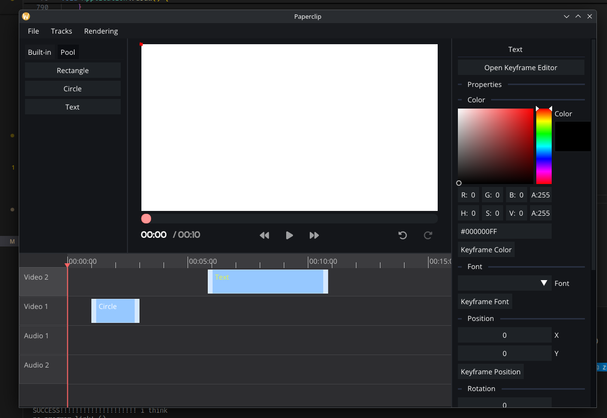

# Paperclip

A free & open source video editor



## Dependencies

Most deps will be aquired through Git via CPM, however some will have to be aquired manually.

### ffmpeg

ffmpeg (version 7.1.1) can be aquired from [here](https://github.com/BtbN/FFmpeg-Builds/releases/tag/autobuild-2025-05-31-14-01) for your platform. Be sure to grab the **lgpl-shared** version. From there, place the binaries in `./libs/ffmpeg/ext/<your platform>` and you can proceed with the build.

## Building

Supported platforms: Linux, macOS, Windows (using msys2)

```
cmake . -B build
cmake --build build
```

